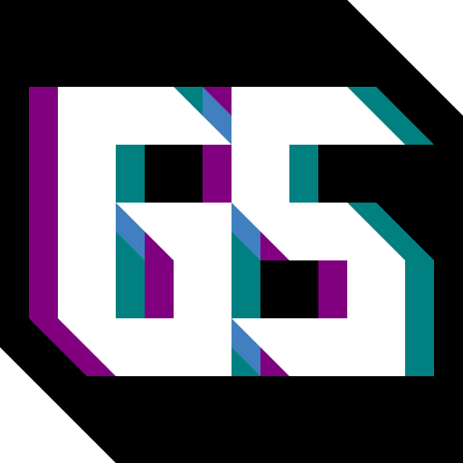
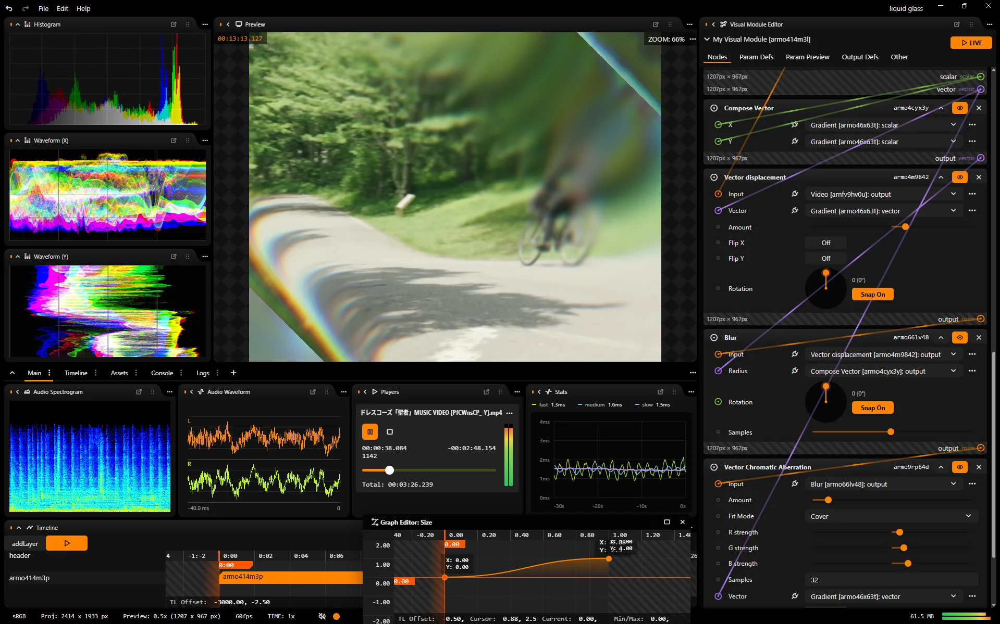

# Glitch Studio (⚠️Under Development!!!)

[アプリを開く](https://syuilo.github.io/glitch-studio/) · [ユーザーガイド](https://syuilo.github.io/glitch-studio/docs/)

Glitch Studioは、リアルタイムな画像・動画の加工・編集・作成を行ったり、シェーダーのplaygroundとして使える統合動画像編集環境です。

- 全ての画像処理がGPU上で行われ、高効率です
- 原則resolution-independentなので、どのような解像度でレンダリングしても見た目が変わらず、一貫した結果が得られます
- 原則fps-independentなので、どのようなフレームレートでレンダリングしても動きの速さが変わらず、一貫した結果が得られます
- 原則aspect-ratio-independentなので、どのような比率でレンダリングしても歪まず、一貫した結果が得られます
- 原則deterministicなので、同じパラメータなら環境によらず同じ結果が得られます
- 原則alpha-awareなので、透明度情報を含む画像もレンダリングできます
- 様々な方法でパラメータを評価できます。式は[AiScript](https://aiscript-dev.github.io/ja/)として解釈可能です
- UIスレッド、音声処理スレッド、画像処理スレッドが分離されていて、マルチコアを活用でき高速に動作します
- Webアプリケーションとしてもデスクトップアプリケーションとして利用可能

アイデア次第で様々なものが作れ、可能性は無限大です。

> [!warning]
> 現在開発初期段階のため、不安定な他、動作しない機能が多数あります！！
> また、プロジェクトファイルの互換性は現段階では一切保証されません！大事なプロジェクトで使用するのはお控えください。

Glitch Studioはいくつかのサブシステムから構成されています。

## Visual Module

様々な「ノード」を配線して、データを加工していくシステムです。

ノードは関数のようなもので、入力を受け取って(受け取らないものもあります)出力を返します。

「データ」は画像とは限らず、スカラー場だったりベクトル場だったりします。つまり二次元的な配列の中になんらかの成分が並んでいるようなデータであれば計算(加工)の対象です。そういう意味ではGPGPUとも言えます。

とはいえ、最終的に出力されるのは画像(動画)です。

Glitch Studioでは異なる型の出力と入力を繋げることも敢えて可能にしています(チェックを厳密に行うオプションもあります)。

何か面白いことが起きるかもしれません…。

## Audio Module

準備中です。

## Timeline

「タイムライン」上にレイヤーを配置し、動画の作成が行えるシステムです。

Visual Moduleを使用して合成を行うレイヤーも作成可能です。

レイヤーのパラメータはキーフレームで制御でき、タイムラインに沿って内容を変化させることができます。

TimelineはVisual Moduleの上位概念となりますが、Visual Module単体で動作(プレビュー)させることも可能です。
